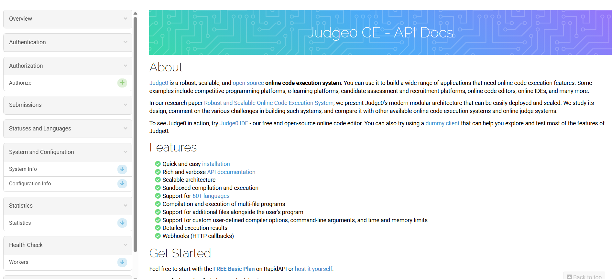
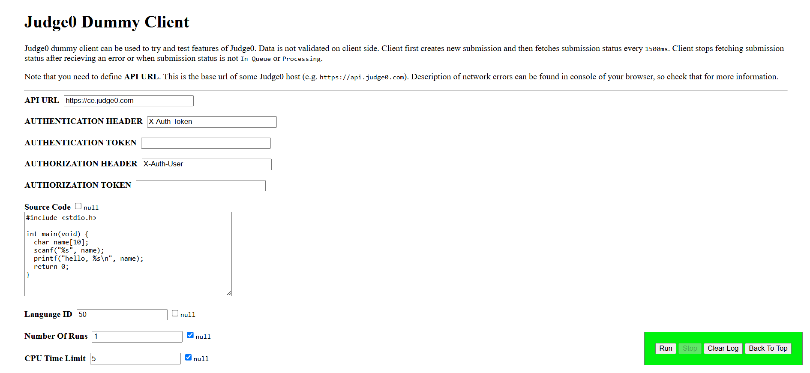

#  Setting Up WSL, Docker, and Judge0 on Windows

---

## **Step 1: Install WSL and Ubuntu**

1. **Enable WSL**  
   - Open **PowerShell** as **Administrator** and run:
     ```powershell
     wsl --install
     ```
   - This will install **WSL** (Windows Subsystem for Linux) along with the default **Ubuntu** distribution.

2. **Restart Your Computer**  
   - After the installation, you’ll be prompted to **restart your computer**.
   - Restart to complete the WSL setup.

3. **Complete Ubuntu Setup**  
   - Open the **Ubuntu terminal** from the Start menu.
   - Follow the prompts to **create a UNIX username and password**.

4. **Update Ubuntu**  
   - Once Ubuntu is set up, run the following commands to update all packages:
     ```bash
     sudo apt update && sudo apt upgrade -y
     ```

5. *(Optional)* **Adjust cgroup settings for better Docker compatibility**  
   - Open the GRUB config file:
     ```bash
     sudo nano /etc/default/grub
     ```
   - Find the line starting with `GRUB_CMDLINE_LINUX` and change it to:
     ```bash
     GRUB_CMDLINE_LINUX="systemd.unified_cgroup_hierarchy=0"
     ```
   - Save and exit (`Ctrl + O`, `Enter`, `Ctrl + X`).
   - Update GRUB and reboot:
     ```bash
     sudo update-grub
     sudo reboot
     ```

---

## **Step 2: Install Docker and Docker Compose**

1. **Install Docker**  
   - Open the **Ubuntu terminal** and run:
     ```bash
     sudo apt update && sudo apt install -y docker.io
     ```
   - (Note: It's better to install `docker.io` package for Ubuntu.)

2. **Install Docker Compose**  
   - Still in the Ubuntu terminal, install Docker Compose:
     ```bash
     sudo apt install -y docker-compose
     ```

---

## **Step 3: Install and Set Up Judge0**

1. **Download and Extract Judge0**  
   - Download the Judge0 release archive:
     ```bash
     wget https://github.com/judge0/judge0/releases/download/v1.13.1/judge0-v1.13.1.zip
     ```
   - Unzip the downloaded archive:
     ```bash
     unzip judge0-v1.13.1.zip
     ```

2. **Set Up Secure Passwords**  
   - **Generate random passwords** for Redis and Postgres:
     - Visit [Random Password Generator](https://www.random.org/passwords/?num=1&len=32&format=plain&rnd=new) and copy the first password.
     - Open the `judge0.conf` file:
       ```bash
       nano judge0-v1.13.1/.env
       ```
     - Update the `REDIS_PASSWORD` with the generated password.
     - Repeat the process for `POSTGRES_PASSWORD` using a new random password.

3. **Start Judge0 Services**  
   - Navigate to the Judge0 folder:
     ```bash
     cd judge0-v1.13.1
     ```
   - Start the database and Redis services:
     ```bash
     docker-compose up -d db redis
     ```
   - Wait for a few seconds:
     ```bash
     sleep 10s
     ```
   - Start the remaining services:
     ```bash
     docker-compose up -d
     ```
   - Wait a few more seconds:
     ```bash
     sleep 5s
     ```

4. **Verify the Installation**  
   - Open your browser and visit:
     ```
     http://localhost:2358/docs
     ```
     ---
    

   - Open your browser and visit:
     ```
     http://localhost:2358/dummy-client.html
     ```
    

   - You should see the Judge0 API documentation page, and Dummy Client page, meaning your Judge0 instance is running successfully!

---